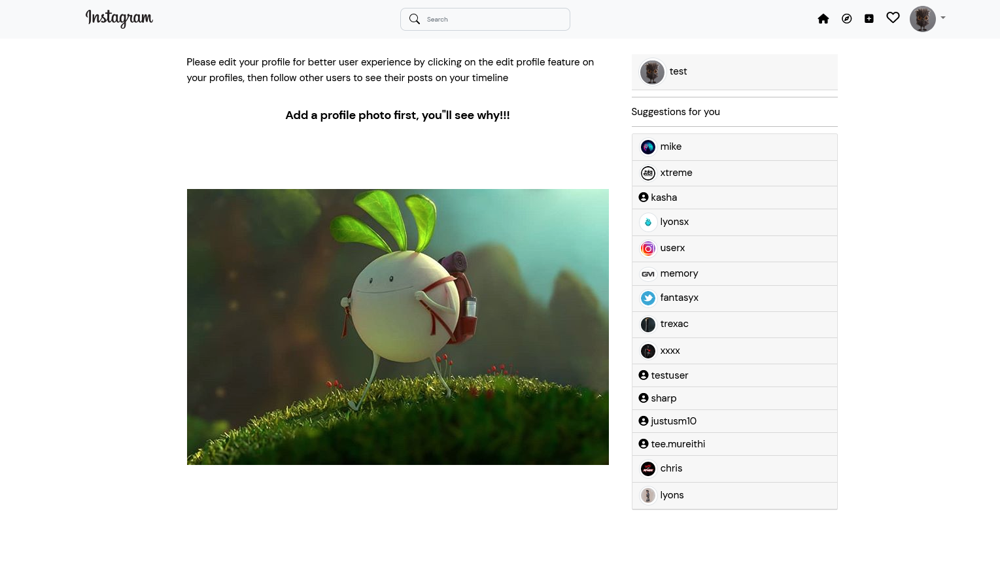

# InstaX

## Description
This is an instagram clone where the user can perform functions same as the ones on the real Instagram, e.g. Post, Like, Follow e.t.c.

### Login view
 

### New user landing page


### Profile page


## Home Page


### View Post


### Another user profile view
 


## Setup Requirements

- Django 
- Python 3.9
- SQLlite
 
## Setup Installation

- Clone this repository.
- Create a Virtual environment.
- Install the required packages from the requirements.txt

```
  python3.9 -m venv env
```

- Activate the virtual environment

```
source virtual/bin/activate
```
- Install the required packages from the requirements.txt

``` 
pip install -r requirements.txt
```

- Edit the .env file with your respective details

- Run the server

```
python manage.py runserver
```

## Technologies Used

The following languages have been used on this project:

- HTML
- CSS
- Bootstrap
- Python
- Django

## Setup/Installation Requirements

- Click to view <a target="_blank" href="https://instaxl.herokuapp.com/">InstaX</a>
    
## Known Bugs

No known bugs

## Author
- LYONS ALBERT

To make a contribution to the code used or any suggestions you can click on the contact link and email me your suggestions.

- Email: lyonsmasawa@gmail.com

## License

Copyright (c) 2022 Lyons Albert Masawa

Permission is hereby granted, free of charge, to any person obtaining a copy
of this software and associated documentation files , to deal
in the Software without restriction, including without limitation the rights
to use, copy, modify, merge, publish, distribute, sublicense, and/or sell
copies of the Software, and to permit persons to whom the Software is
furnished to do so, subject to the following conditions:

The above copyright notice and this permission notice shall be included in all
copies or substantial portions of the Software.

THE SOFTWARE IS PROVIDED "AS IS", WITHOUT WARRANTY OF ANY KIND, EXPRESS OR
IMPLIED, INCLUDING BUT NOT LIMITED TO THE WARRANTIES OF MERCHANTABILITY,
FITNESS FOR A PARTICULAR PURPOSE AND NONINFRINGEMENT. IN NO EVENT SHALL THE
AUTHORS OR COPYRIGHT HOLDERS BE LIABLE FOR ANY CLAIM, DAMAGES OR OTHER
LIABILITY, WHETHER IN AN ACTION OF CONTRACT, TORT OR OTHERWISE, ARISING FROM,
OUT OF OR IN CONNECTION WITH THE SOFTWARE OR THE USE OR OTHER DEALINGS IN THE
SOFTWARE.
